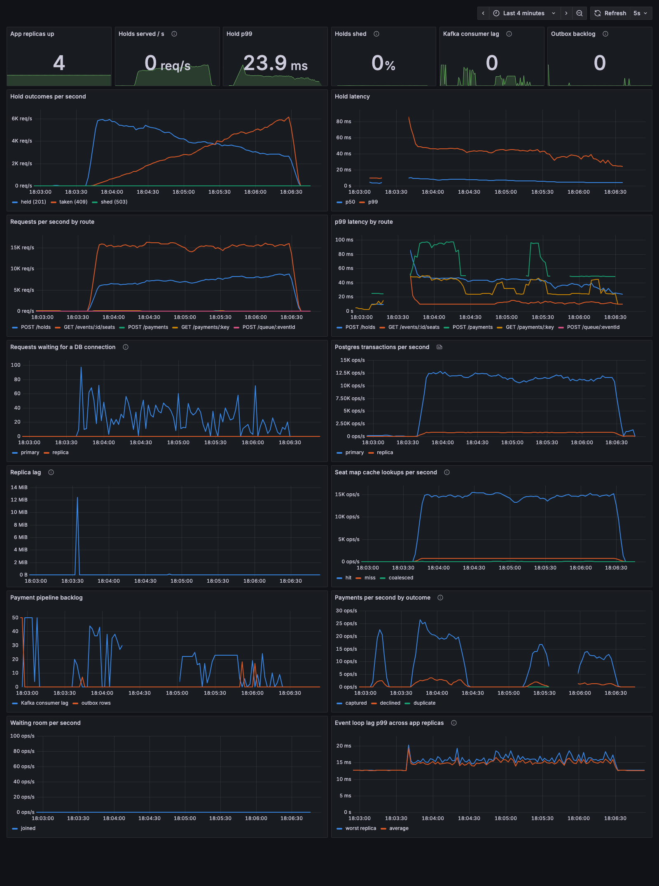

# seatrush

A flash-sale ticket booking system, scaled one stage at a time. Each stage is load tested, deliberately broken, and fixed. The rule that must never break: **no seat is sold twice.**

Stack: Node 22 + TypeScript, Fastify, Postgres (3 shards, primary + replica on shard 0), PgBouncer, Redis, Kafka, nginx, Prometheus, Grafana, k6.

Per-stage notes (what we built, what failed, numbers) live in [`progress/`](progress).

| stage | focus | status |
|---|---|---|
| 0 | correct monolith + baseline | done |
| 1 | stateless app servers, connection pooling | done |
| 2 | caching, read replicas | done |
| 3 | waiting room, queues, idempotency | done |
| obs | Prometheus + Grafana dashboard | done |
| 4 | partitioning, hot partitions | done |
| 5 | multi-region, CDC | |

Quick start: see [progress/stage-0.md](progress/stage-0.md#run-it).
