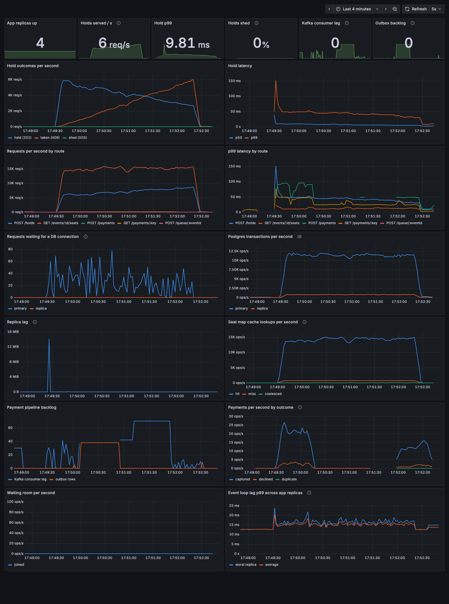

# Observability: Prometheus + Grafana

Added between stages 3 and 4, so partitioning and the hot shard can be watched live instead of only read from tables.

## What we built
- `src/metrics.ts` (prom-client), shared by every process:
  - **API:** latency histogram per route and status, cache `hit` / `miss` / `coalesced`, DB pool waiters (the load shedding signal), waiting room joins and admissions, plus Node defaults (event loop lag, heap, CPU). Served on `/metrics` per replica; nginx returns 404 for it publicly.
  - **Payment worker:** payments by outcome (`captured`, `declined`, `duplicate` redelivery), provider latency.
  - **Outbox relay:** rows published, outbox backlog.
- **Prometheus** (`localhost:9090`), scraping every 2s. App and worker replicas are discovered through Docker DNS, so `--scale app=N` needs no config change.
- **Exporters:** postgres-exporter for the primary and the replica (commits, connections, replication lag), kafka-exporter (consumer lag).
- **Grafana** (`localhost:3001`, no login), with the datasource and dashboard provisioned from `observability/grafana`.

## Reading the dashboard
| row | panels | what to look for |
|---|---|---|
| tiles | replicas up, holds served/s, hold p99, shed %, Kafka lag, outbox backlog | the headline numbers |
| holds | outcomes per second (held / taken / shed), p50 and p99 | shedding kicking in during a spike |
| routes | rate and p99 per route | which endpoint degrades first |
| database | pool waiters, Postgres commits/s on primary vs replica | how close the primary is to its ceiling |
| replication, cache | replica lag in WAL bytes, cache hit / miss / coalesced | stampedes show up as a miss spike |
| payments | Kafka lag + outbox backlog, payments by outcome | an outage: outbox climbs, then lag, then drains |
| edge | waiting room joins / admissions, event loop lag | a replica that is CPU-bound itself |

Design choices:
- Each series is its own query with a fixed color, so `POST /holds` is the same blue in every panel (Grafana's palette would otherwise cycle colors).
- One axis per panel, 2px lines, no fills.
- A legend appears whenever a panel has more than one series.

## What the dashboard caught: slow payment recovery after a Kafka outage

The scenario (3 minutes): steady browse and hold load, Kafka stopped for 40s, then the payment worker SIGKILLed for 20s.

**Before** (`img/dashboard-chaos.png`): payments stopped when Kafka went down and did not resume after it came back. They only resumed once the worker had been killed and restarted, a gap of about 95s.



**Diagnosis** (pinned down with the Prometheus timeline):
- **The relay was fine.** The outbox drained within 2s of Kafka returning.
- **The consumer was the slow side.** Consumer lag then sat at 50 to 100 for ~28s, measured at 34s from Kafka restart to payments flowing.
- **Two causes:**
  1. A member that dies during the outage is only evicted after the **30s session timeout**.
  2. kafkajs's reconnect backoff had grown to ~12s.

| change | payments resume after Kafka returns | after worker SIGKILL |
|---|---|---|
| defaults | 34s | 30s+ (stage 3) |
| capped reconnect backoff only | 34s (no change) | |
| session timeout 10s only | 34s | 11s |
| **both** | **15s** (2 runs) | 11s |

The trade-off with a 10s session timeout: if a worker stalls longer than that (long GC, CPU starvation), Kafka rebalances it away even though it is alive.

**After** (`img/dashboard-chaos-after.png`): payments resume about 20s after Kafka returns and about 7s after the worker restarts.


## Smaller things that broke
- **No Kafka lag on the panel:** this kafka-exporter version publishes per-partition `kafka_consumergroup_lag` but not `kafka_consumergroup_lag_sum`, so the panel queried a metric that did not exist. Verified with a test: lag rose to 30 with the worker stopped and drained to 0.
- **Replication lag in seconds lies:** `pg_replication_lag_seconds` keeps growing while there are no writes, even when the replica is fully caught up. The panel uses `pg_stat_replication_pg_wal_lsn_diff` (bytes behind) instead.
- **Event loop lag never drops below ~10ms:** that floor is the sampler's resolution, not real lag. It is noted in the panel description.

## Run it
```bash
docker compose up -d --wait --scale app=4
open http://localhost:3001        # dashboard
open http://localhost:9090/targets  # every scrape target should be UP
```
