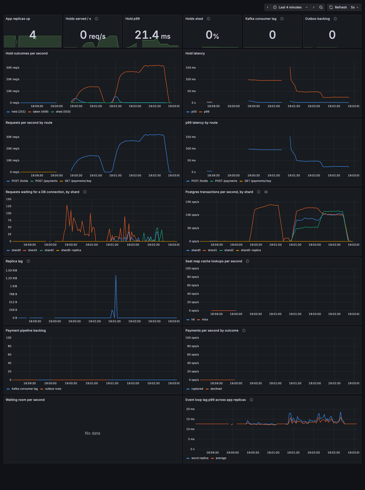

# Stage 4: partitioning, the hot partition, live rebalancing

**Goal:** one Postgres primary was the ceiling for every write. Split the data across shards, survive the event that puts all its traffic on one shard, and move data between shards without downtime.

## What we built
- **Compound seat key** `(event_id, seat_no)` instead of a global serial id, with 1000-seat sections. Seat maps are served per section (`/events/:id/sections/:s/seats`), because a 50K-seat stadium map would be megabytes of JSON.
- **3 shards:** shard 0 is the original primary + replica (behind PgBouncer) and also holds the **catalog** (events, partition map, simulated provider ledger). Shards 1 and 2 are extra primaries.
- **12 logical partitions** (`src/shards.ts`): `hash(event_id, section) mod 12`, or `hash(event_id)` with `PARTITION_BY=event`. The catalog maps partition to shard, and routers refresh that map every second.
- **Fencing:** each shard has `owned_partitions`, and a trigger rejects writes for any other partition (`SR001`, mapped to 503).
- `scripts/move-partition.ts`: live partition move (fence, copy, flip, clean).
- `scripts/reconcile-payments.ts`: re-enqueues payments that have been pending too long.
- Invariants now also check that every row sits on the shard that owns its partition, and that each shard's fence agrees with the catalog.
- `PG_CPUS` caps each shard's CPU, to model shards as separate fixed-size machines on one laptop.

## Design choices (DDIA ch 6)
- **Fixed number of partitions, more than shards.** Adding or rebalancing a shard moves a few whole partitions; nothing is rehashed. `hash mod N_shards` would move almost every row when N changes.
- **Hash, not ranges.** Consecutive event ids and the sections of one event land on unrelated partitions, so new events do not pile onto one shard. The cost: no efficient range scans across events, which this product never needs.
- **No foreign keys across shards.** Events live in the catalog, seats on the shards.
- **Payments stay with their seat's shard,** so a payment and its seat update are one local transaction, never a distributed one.

## 1. Does sharding scale writes?

Uniform holds across 1000 events, 4 app replicas, 400 VUs:

| setup | 1 shard | 3 shards |
|---|---|---|
| uncapped (all share the laptop's 10 cores) | 15.6K/s | 17.9K/s |
| **1 CPU per shard** (separate machines) | 6.3K/s | **17.1K/s (2.7x)** |

Uncapped, the machine was 97% busy (k6 1.5 cores, 4 app replicas 2.6, nginx 0.75, Postgres ~3.3): adding database "machines" that share the same cores adds nothing. With each shard capped at 1 CPU, 3 shards give 2.7x, and p99 at 100 VUs drops from 74ms to 23ms. The remaining gap to 3x is the app tier and the laptop.

## 2. The hot partition

All holds on event 1, a 50,000-seat stadium (50 sections), 3 shards at 1 CPU each:

| partition key | holds served/s | p99 | txn/s by shard (0 / 1 / 2) |
|---|---|---|---|
| `event_id` | 10,276 | 80ms | 32 / **10,778** / 30 |
| `(event_id, section)` | **22,329** | 50ms | 8,480 / 12,711 / 5,014 |

Keyed by event, one shard does all the work and the other two idle: adding shards does nothing for the event everybody wants. Keying by `(event, section)` is DDIA's "add something to the key" fix for skew: the stadium spreads over many partitions. The cost: a seat map for a whole event would be a scatter-gather, which is why maps are per section.

**Still skewed:** 50 sections over 12 partitions do not hash evenly. The stadium's sections per shard came out **16 / 24 / 10**, with partition 4 alone holding 8 sections on shard 1. That is what rebalancing is for.

## 3. Live rebalancing: moving a partition

```
1. fence   source: DELETE owned_partitions (takes the partition's advisory lock
           exclusively, so in-flight writes finish first and new ones wait)
2. copy    target (one transaction): claim ownership, then copy seats, bookings, payments
3. flip    catalog: partition -> target; routers pick it up within 1s
4. clean   source: delete the old copies
```
Writers take the partition's advisory lock in shared mode, inside the fence trigger. A stale router that writes to the source after step 1 gets `SR001` -> 503 -> the client retries -> the router has refreshed -> the target. Outbox rows stay put: the relay drains every shard.

Live result: all holds on the stadium, payments in flight on the moving partition, move partition 4 from shard 1 to shard 2.

| | holds served/s | txn/s by shard (0 / 1 / 2) |
|---|---|---|
| before | 23,704 | 7,707 / **11,463** / 4,855 |
| after | **30,940** | 10,178 / 10,084 / 11,172 |

Writes to that partition paused for **1.2s** (97,000 seats, 224 bookings, 295 payments copied). k6: 1.59M requests, **0 failed**. Payments: 591 accepted, **0 stuck**. Invariants OK.

Dashboard during the three phases (by event, by section, after the move), panel *Postgres transactions per second, by shard*:



## What broke (and what the invariant checker caught)

### 1. A move that died halfway left a partition owned by nobody
The first live move crashed in step 2. The **target's own fence rejected the copied payments**, because it claimed ownership only *after* the copy. The source had already given up ownership, so partition 4 belonged to no shard: 306 holds got 503 and 46 payments got stuck. `npm run check` reported `fence_mismatch: 1`.

The idle test before it had passed only because there were 0 bookings and 0 payments to copy (copying seats does not fire the insert trigger).

Fix: the target claims ownership first, in the same transaction as the copy, so a failed copy rolls the claim back too. And every step is idempotent (`ON CONFLICT DO NOTHING`), so **rerunning the same command finishes a half-done move**. Rerunning it repaired the broken partition; the 46 payments drained.

### 2. kafkajs silently skipped failed batches: 25 payments lost
On the next live move, worker batches hit the fence during the 1.2s pause. kafkajs then committed offsets of *later* successful batches past the failed ones. Consumer lag read 0, so the messages were gone, and 25 payments sat `pending` forever. Only the invariant checker noticed.

Fixes, in layers:
1. **Retry in place:** transient errors (fence, no map, connection, shutdown) are retried inside the handler until they clear, so the batch does not fail.
2. **Fail stop:** any other batch error exits the worker before anything later can be committed. Docker restarts it (`restart: unless-stopped`) and Kafka redelivers the batch.
3. **Reconciler:** `scripts/reconcile-payments.ts` re-enqueues payments pending over 30s through the outbox. It repaired the 25. Duplicates are safe because the worker and provider are idempotent.

Next live run: 591 payments, 0 stuck, 0 worker restarts.

### 3. One database restart crashed every process
Restarting the shards killed the relay (and could kill the API and worker). node-postgres emits `error` when the server kills a connection, and with no listener Node exits. This happened twice, in two variants:
- **Idle connections:** fixed with `pool.on('error')`.
- **Checked-out clients mid-transaction:** these emit on the client itself, not the pool. Fixed by attaching a listener to every client on connect.

Recreating all three databases under hold and payment load: 307 lost connections logged, 0 crashes.

### 4. Routing with a partial map
While a reseed rebuilt the catalog, routers loaded an empty partition map, and `route()` returned a shard that does not exist: 1,433 TypeErrors (500). Now a map is only swapped in when it has all 12 partitions, routing without one throws `SR002`, and every transient error (`SR001`, `SR002`, `08xxx` connection, `57Pxx` shutdown) is a 503 + Retry-After instead of a 500.

### 5. Benchmarks measured a restart, not the system
- **PgBouncer caches a failed login** for `server_login_retry` (15s) after a database restart, rejecting everything with "the database system is shutting down". The first sweep level after changing `PG_CPUS` had 22 to 60% errors. The sweep now waits until holds succeed on *every* shard. The first version of that wait probed one event, which happened to live on a healthy shard, and a later run still had 14% errors.
- **lag-check passed trivially** after sharding: event 1 landed on a shard without a replica. It now takes an event id. On a shard-0 event with 100ms of replica lag: 0 of 100 stale with the LSN token, 100 of 100 without.
- **Fresh stack crash:** processes loaded the partition map at boot and crashed until the first seed. The map now loads in the background. A metrics collector querying a not-yet-created table also crashed the relay through an unhandled rejection; scrapes now fail with 500 instead.

## Costs and limits
- **Fencing costs about 4 to 10%** of hold throughput (a trigger, a shared advisory lock and an index lookup per write).
- **A stale router can return a false 409** for up to ~1s after a move: its `UPDATE` matches no row on the source because the rows were deleted. The seat is free on the target, and the next try succeeds.
- **The move script is the coordinator.** Production would run moves from a coordinator with a persisted state machine; here, idempotent steps plus "run it again" cover crashes.
- **Only shard 0 has a read replica** (laptop budget). Shards 1 and 2 serve seat maps from the primary behind the cache. Read-your-writes works per shard because a hold and its section map always share a shard.
- **Payment idempotency keys are unique per shard,** not globally. A client reusing one key for two seats on different shards would get two payments.
- Not done: adding a 4th shard. It is a `SHARDS` entry plus moves, and the moves are what was tested.

## Takeaways
1. Partitioning only helps if the key spreads the load you actually get. The hot event is the load that matters.
2. Skew survives good keys: hashing 50 sections into 12 partitions still gave 16 / 24 / 10. Rebalancing is part of partitioning, not an afterthought.
3. Moving data while it is being written needs fencing at the data layer. A cached routing map is always slightly stale.
4. Every multi-step operation must be safe to rerun, because it will die halfway.
5. Delivery guarantees are only as good as the client library's failure path. Check the invariant, not the lag graph.

## Next: stage 5
Multi-region: events get a home region for writes, reads are served locally, and CDC streams changes out of the shards.

## Run it
Seed arguments changed in this stage: `node scripts/seed.ts [events] [seats] [hotSeats]`, and `SHARDS_USED` / `PARTITION_BY` are env vars.
```bash
docker compose up -d --wait --scale app=4
npm run seed -- 1000 1000 50000          # 1000 events + a 50K-seat stadium
PG_CPUS=1 SHARDS_USED=1 npm run sweep -- 4 400
PG_CPUS=1 SHARDS_USED=3 npm run sweep -- 4 400

# hot event, both partition keys
PG_CPUS=1 PARTITION_BY=event   HOT_SEATS=50000 EVENTS=1 SEATS=50000 npm run sweep -- 4 400
PG_CPUS=1 PARTITION_BY=section HOT_SEATS=50000 EVENTS=1 SEATS=50000 npm run sweep -- 4 400

node scripts/move-partition.ts 4 2       # rerun it if it dies halfway
node scripts/reconcile-payments.ts       # re-enqueue payments pending > 30s
npm run check                            # includes placement and fence checks
```
