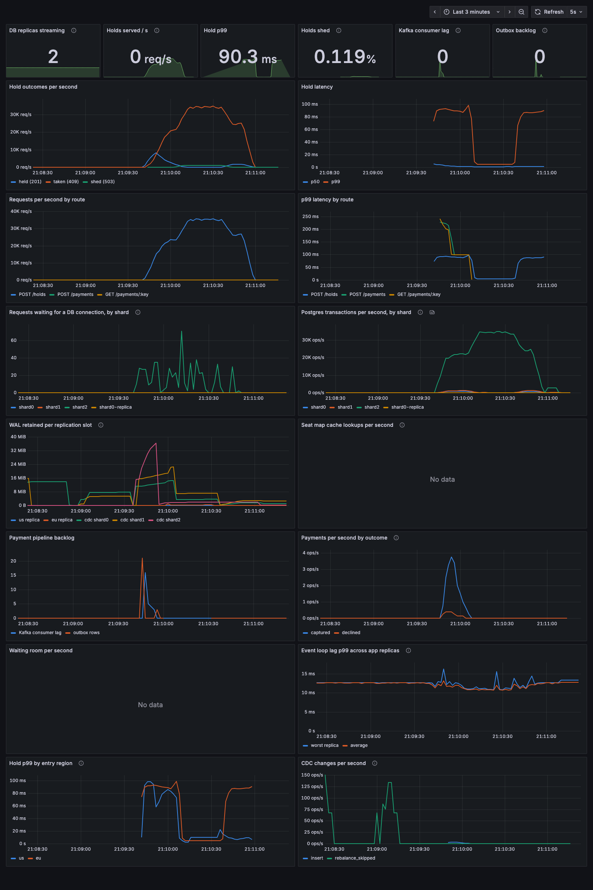

# Stage 5: multi-region and change data capture

**Goal:** serve users in two regions without double-selling a seat, keep each region alive when the other is unreachable, and stream changes out of the shards without touching the write path.

## What we built
- **Two simulated regions.**
  - **us:** shards 0 (+ catalog + a local replica) and 1, Kafka, the payment pipeline, CDC.
  - **eu:** shard 2, a replica of shard 0, its own API replicas, nginx (`localhost:8081`) and Redis.
  - Every cross-region connection goes through **toxiproxy**. `regions/latency.sh 40` sets 40ms each way (about us-east to eu-west); `cut` partitions the regions.
- **Home region per event:** the region of the shard holding its partition. Moving a partition (stage 4) re-homes events.
- **Write forwarding** to the home region, with a timeout and a per-region **circuit breaker**.
- **Replication slots** for the physical replicas, capped by `max_slot_wal_keep_size`.
- **CDC** (`src/cdc.ts`): logical decoding (`pgoutput`) of `bookings` on every shard into a sold-seats read model in both regions' Redis. `GET /events/:id/stats` serves it without touching a shard.
- Tools: `scripts/region-check.ts`, `scripts/chaos/region-cut.sh`, `scripts/rebuild-read-model.ts`. `npm run check` now also compares the read model with the shards in both regions.

## Design choices
- **Single leader per event, not multi-leader.** Two regions accepting writes for the same seat would need conflict resolution, and every resolution of "two people bought seat 12" is a double sale. Each event has one home region, and its writes go there (DDIA ch 5). The trade-off: a remote user pays one round trip per write, and if the home region is unreachable, nobody can buy that event.
- **Forward requests, not queries.** A remote write is one HTTP call to the home region's API, not a transaction run against a remote database.
- **Reads stay local.** Seat maps come from the local cache and local replica. The stage 2 LSN token still guarantees read-your-writes across regions.

## 1. What a remote write costs (80ms round trip)

`scripts/region-check.ts`, one user at a time:

| an eu user buys... | hold | payment |
|---|---|---|
| an eu event (local) | 2ms | 2ms |
| a us event, eu API runs the transaction on the us database | 168ms | **415ms** |
| a us event, **request forwarded to the us API** | **88ms** | **88ms** |

Against a remote database every statement is a round trip: a hold is 2 (UPDATE, LSN), a payment about 5 (BEGIN, INSERT, UPDATE, INSERT outbox, COMMIT). Row locks are also held across the ocean the whole time. Forwarding costs exactly one round trip, whatever the transaction does.

## 2. Cross-region replica and read-your-writes
- **Replay lag:** the eu replica of shard 0 replays 84ms behind (about one RTT), against 0.8ms for the us replica.
- **Read-your-writes:** an eu user who holds a seat on a us event (forwarded), then reads the seat map in eu with the LSN token: **0 of 100 stale**.
- **No fallback needed:** 60 of 60 of those reads were served by the *local* eu replica (p50 4ms). None fell back to the us primary. The forwarded hold's response and the WAL stream to the eu replica cover the same distance at the same time, so by the time the client has the token, the local replica usually has the write.

## 3. What broke: the us replica had been dead for an hour
Starting this stage, `pg_stat_replication` listed one replica, not two. The us replica had fallen behind during stage 4's heavy runs, and the primary recycled WAL it still needed:
`requested WAL segment ... has already been removed`. It sat there replaying nothing.

**The dashboard said replica lag was 0:** `pg_stat_replication` only lists *connected* replicas, so a dead one just disappears from the lag panel. (Stage 4's read-your-writes result still stands: the replica was alive during that test and died about 3 minutes later.)

Fix:
- Replicas stream from **named replication slots**, so the primary keeps WAL until each has consumed it.
- **`max_slot_wal_keep_size=2GB`**, because a slot for a dead replica would otherwise keep WAL forever and fill the disk.
- The dashboard counts **replicas streaming** and plots **WAL retained per slot**, which also covers the CDC slots.

## 4. Region partition: cut the link for 30s

`scripts/chaos/region-cut.sh`. eu users buy eu events (100 VUs, closed loop) and us events (1000 arrivals/s, open loop, forwarded).

| | before the fix | after the fix |
|---|---|---|
| eu-local: requests / failed / max | 952K / 0% / **20,302ms** | 1.86M / 0% / **78ms** |
| forwarded: failed | **57.9%** (client timeouts) | **0%** (35,331 instant 503s) |
| forwarded: p50 / p99 | 8,912ms / 24,705ms | 82ms / 2,002ms |
| forwarded: never sent (load generator out of VUs) | 9,074 | 0 |

**Before:** forwards had no timeout. Every forwarded request hung for the whole cut. Thousands piled up in the eu apps (85% CPU, memory 5x), and even purely local requests stalled for up to 20s. After the link healed, p50 stayed in seconds because new requests queued behind dead connections.

**Fix: every network call has a deadline.**
- Forwards time out after 2s.
- A **per-region circuit breaker**: after one failure, requests for that region's events get an instant 503 + Retry-After for 5s, then a single probe tests the link (closed, open, half-open).
- Database pools have connect and query timeouts, so cross-region queries such as the partition map refresh cannot hang either.

The result is the right trade-off for a ticketing system: during the cut, eu users cannot buy us events and are told so immediately; everything homed in eu is untouched; nothing is double-sold.

The first breaker I wrote marked the region "down" before *every* forward, which would have serialized all cross-region traffic to one request at a time. It was caught in review before testing and rewritten as closed / open / half-open.

## 5. CDC: a read model straight from the WAL

- **Correctness:** 400 payments across both regions gave 362 bookings, and the read model matched per event in both regions.
- **Consumer down for a load run:** the read model goes stale (expected), and the shards keep the WAL for it in the slot (16MB here). On restart it catches up with nothing lost; replays are idempotent set adds.
- Every result ends with `npm run check` comparing the read model with the shards.

### What broke: a healthy consumer still pinned WAL forever
With the consumer running, shard1's CDC slot held 25MB and kept growing under hold traffic. **A logical slot pins all WAL, not just the published table**, and `pgoutput` skips transactions that do not touch `bookings`. With only holds happening, no commit ever arrived to acknowledge, so the slot's confirmed position never moved. On a busy database whose published table changes rarely, this fills the disk.
Fix: also confirm the server's keepalive position when it asks for a reply (only when nothing is buffered). Retention dropped to about 1MB.

### What broke: 12 changes per second
The consumer applied each change on its own and waited for both Redis instances, the eu one across the 80ms link. A burst of 3000 bookings took **246s** to reach the read model, so CDC lag would grow without bound under any real burst.
Fix: buffer changes and write one Redis pipeline per region every 50ms (or at 1000 pending, which also applies backpressure). The acknowledged position is the last commit in the flushed batch. Same burst: **1.5s** (164x).

### What broke: a partition move un-sold every seat in the partition
CDC sees **physical row changes, not business events**. A partition move inserts copies on the target and deletes the originals on the source. The consumer read those deletes as seats being unsold: moving an event's partition from shard 1 to shard 0 dropped it from **268 seats sold to 0**, every time. The opposite direction happened to heal it, since the two shards' streams interleave differently, which made it look flaky rather than broken.

Fix:
- The move script runs its copy and cleanup under the **replication origin** `rebalance`.
- `pgoutput` reports the origin at the start of those transactions, and the consumer skips them: 3,752 changes skipped over 7 moves, read model unchanged.
- The damage that already existed was repaired with `scripts/rebuild-read-model.ts`: stop the consumer, rebuild from the shards, start it. Its slot replays anything newer, and replays are idempotent.

### What broke: an idempotency key returned someone else's payment
While testing CDC, 120 new payments never reached the read model, because they never existed. The test reused idempotency keys (`pay-0`...) for a new event on the same shard, and `POST /payments` returned the *existing* payment's status for the key: "captured", with nothing created. Fix: a key only replays the request it was first used for (same event, seat and user); otherwise 422, as Stripe does. `GET /payments/:key` also matches only that seat.

## Final regression on the full stack
| test | result |
|---|---|
| `scripts/chaos/region-cut.sh` | eu-local 1.86M requests, 0 failed, max 78ms; forwarded 0 failed |
| `scripts/chaos/kafka-outage.sh` | 400 payments, 0 stuck, 0 double booked |
| `scripts/chaos/worker-kill.sh` | 5 redelivered charges deduplicated, 0 stuck |
| `npm run check` after each | INVARIANT OK, read model matches in both regions |

Dashboard during the region cut, with payments and a partition move in the same window:



## Costs and limits
- **The home region is a single point of failure for its events' writes.** Surviving a whole region loss for writes means failing a shard over to a replica in another region. With async replication that loses the last acknowledged writes (here, up to about one RTT of bookings). Not built: it needs fencing of the old leader and consensus on who is the leader (DDIA ch 9).
- **Kafka, the payment pipeline and CDC live only in us.** An eu payment is forwarded to us anyway (its event's shard decides), but a us outage stops payment processing for eu events too.
- The eu read model is written by a consumer in us across the link, so it trails by at least one RTT and stops updating during a cut.
- Everything is one laptop: regions are container groups, and the "network" is toxiproxy latency. The behaviors are real; the absolute numbers are not a datacenter's.

## Takeaways
1. Pick one leader per piece of data that must not conflict. Multi-leader for seat inventory means double sales.
2. Cross-region, count round trips, not milliseconds. Forward the request, not the queries.
3. Every network call needs a deadline, and a remote dependency needs a circuit breaker, or one unreachable region takes the healthy one down with it.
4. Monitoring that only lists healthy things cannot show you a dead one.
5. CDC is physical, not semantic. Know which changes are business events, and be able to rebuild the read model from the source of truth.
6. A slot is a promise to keep WAL. Make sure something always lets the primary forget it.

## Run it
```bash
docker compose up -d --wait --scale app=4 --scale app-eu=2
regions/latency.sh 40                                  # ~80ms RTT between regions
npm run seed -- 200
node scripts/region-check.ts http://localhost:8081 <us-event-id>   # eu user, us event
FORWARD_WRITES=off docker compose up -d app-eu         # compare: remote database
scripts/chaos/region-cut.sh
curl localhost:8080/events/<id>/stats                  # CDC read model
docker compose stop cdc && node scripts/rebuild-read-model.ts && docker compose start cdc
npm run check
```
